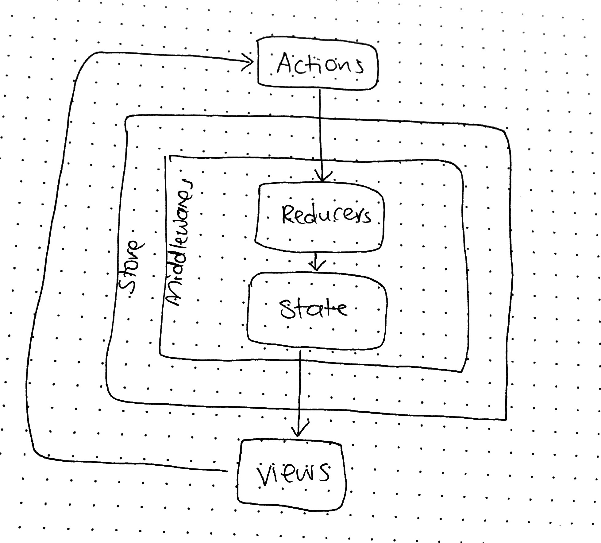

# LAB - 37

## Project Dental - Front-end

### Author: Joanna Arroyo

### Links and Resources
* [submission PR](https://github.com/joanna-401-advanced-javascript/project-dental-front/pull/2)
* [travis](https://travis-ci.com/joanna-401-advanced-javascript/project-dental-front)
* [front-end](https://dental-materials.herokuapp.com/)

#### Documentation
* [styleguide](http://192.168.2.67:6060/)

### Modules
#### `index.js` `app.js` `Header.jsx` `Details.jsx` `auth.js` `login.js`
#### `main-reducer.js` `material-reducer.js` `detail-reducer.js` `user-reducer.js`
#### `detail-actions.js` `material-actions.js` `user-actions.js` `setupTests.js`

##### Exported Values and Methods
###### `app.js -> React Class component`
###### `Header.js -> React functional component`
###### `Details.js -> React Class component`
###### `main-reducer.js -> React functional component`
###### `material-reducer.js -> React functional component`
###### `detail-reducer.js -> React functional component`
###### `detail-actions.js -> React functional components`
###### `material-actions.js -> React functional components`

### Setup
#### `.env` requirements
* `REACT_APP_API` - URL to the running server
* `REACT_APP_SECRET` - Same secret as is used on the server
#### Running the app
* `npm start`
  
#### Tests
* Unit tests: `npm run test`
* Lint tests: `npm run lint`

#### UML
